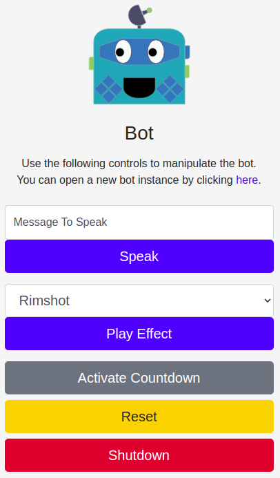

# SVG Animated Puppet

This is an interactive web-based animated puppet.  It will provide one URL for the `bot`, which is an SVG image that has various animations controlled by another page `index` which contains the puppet master controls.




## Running in Development

To run locally on your machine, make sure you have `node` and `npm` installed, then run the following.

```bash
git clone https://github.com/jwilliamsnephos/svg-animated-puppet.git
cd svg-animated-puppet
npm install
npm run start
```

Now you can open a browser to [http://localhost:8080/](http://localhost:8080/), you can open the bot in aseperate browser at [http://localhost:8080/bot/](http://localhost:8080/bot/).

## Technology Stack

The technology stack used includes

* [Node.js](https://nodejs.org/en/) - For web services and server side operations
* [Express.js](https://expressjs.com/) - As the web application framework
* [Socket.IO](https://socket.io/) - For realtime socket interactions between the `bot` and the `puppet master controls`
* [SVG](https://svgjs.com/docs/3.0/) - As our SVG image manipulation framework


# Speech / Voices

The speech is provided by [espeak](https://github.com/espeak-ng/espeak-ng) with specific voices provided by [MBROLA](https://github.com/espeak-ng/espeak-ng/blob/master/docs/mbrola.md).

Install them with the following.

```bash
sudo apt install espeak
sudo apt-get install mbrola mbrola-en1
```

## Text to Speech Function

If you want to change the voice used by the puppet, modify the `speak` function (`let speak = function (message)`) within the `index.js`.

## Mouth Movement Animations

The mouth movement of the puppet is logically simulated by analyzing the contents of the sentance by looking at the words and the syllables contained in the sentance.  It's not exact, but is good enough to pull of the **illusion** of the words being spoken.  To adjust the mouth movement of the puppet, modify the `talk` function (`const talk = function (sentance)`) within the `./js/bot.js`. Specifically, you can modify the `duration` the mouth is to remain open per syllable (`let duration = 80 - (2 * syllableIndex);`) and the `nextDelay` between words and sentances.

